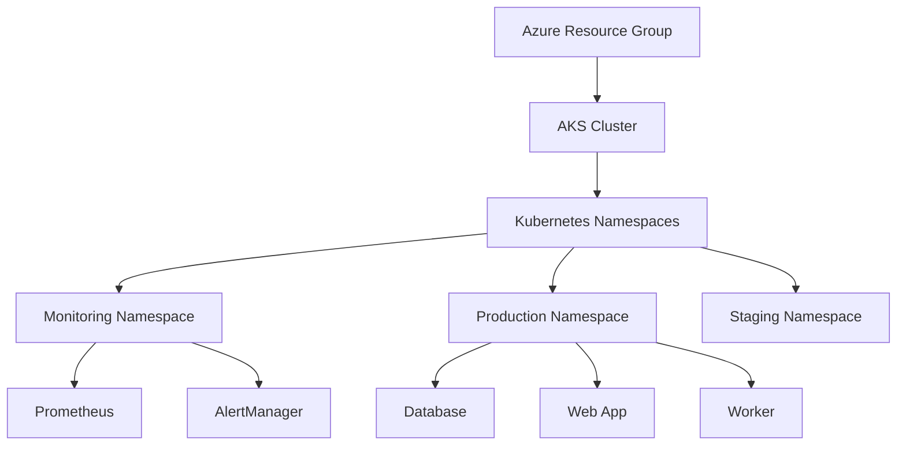

## 🏗 Infrastructure Overview

- **Cloud Agnostic**: Deploy on any major cloud provider with minimal changes
- **Terraform-Powered**: Infrastructure as Code for consistent and repeatable deployments
- **Microservices Architecture**: Modular design with separate web app, database, and worker components
- **Built-in Monitoring**: Prometheus and AlertManager integration for comprehensive system observability
- **Production-Ready**: Includes staging and production environments out of the box

Our infrastructure is designed for scalability, resilience, and ease of management. Here's a high-level overview:



## Components

### Web Application
- MVC architecture with controllers, models, and routes

### Database
- Custom-designed for optimal performance

### Worker
- Python-based for versatile task processing

### 📊 Monitoring
- Prometheus for metrics collection
- AlertManager for intelligent alerting
- Comprehensive visibility into your entire stack

## 🚀 Deployment Process

Getting started is a breeze:

1. **Set up Azure credentials**:
   ```sh
   export ARM_CLIENT_ID="your-client-id"
   export ARM_CLIENT_SECRET="your-client-secret"
   export ARM_TENANT_ID="your-tenant-id"
   export ARM_SUBSCRIPTION_ID="your-subscription-id"
   ```

2. **Initialize Terraform**:
   ```sh
   terraform init
   ```

3. **Review the planned changes**:
   ```sh
   terraform plan
   ```

4. **Apply the changes**:
   ```sh
   terraform apply
   ```

5. **Access your cluster**:
   ```sh
   az aks get-credentials --resource-group <your-resource-group> --name <your-cluster-name>
   ```

## Cloud Agnostic Approach

Our project embraces cloud agnosticism through:

1. **Containerization**: Docker ensures consistency across environments
2. **Kubernetes**: The ultimate in portable orchestration
3. **Terraform**: Infrastructure as Code that speaks multiple cloud languages

Deploying to a different cloud? Simply:
1. Update the Terraform provider configuration
2. Adjust any cloud-specific resources
3. Update necessary environment variables or secrets

## 📄 License

This project is licensed under the MIT License - see the [LICENSE.md](LICENSE.md) file for full details.

---
Helm Repository: https://github.com/AtakanG7/gh-pages
Ready to revolutionize your cloud infrastructure? Star ⭐ this repo and join us in building the future of cloud-agnostic deployments!
