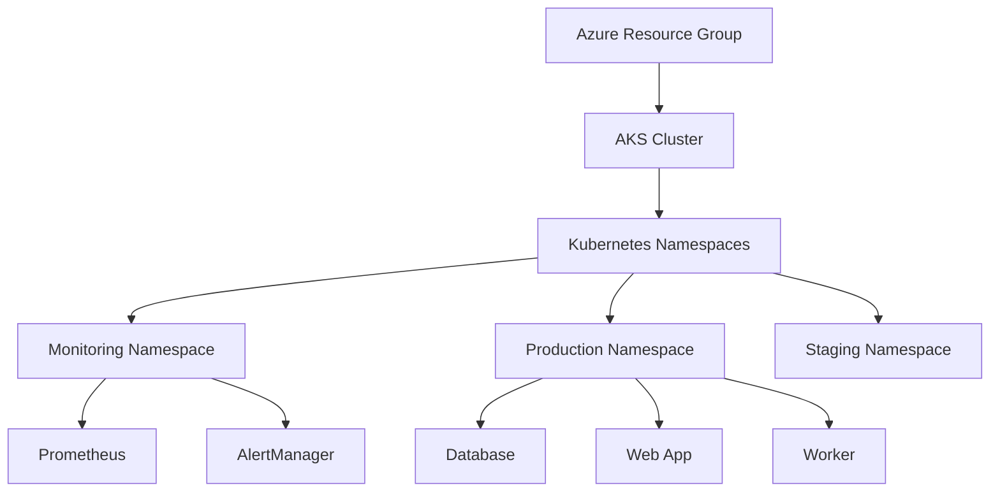

## 🏗 Infrastructure Overview

- **Cloud Agnostic**: Deploy on any major cloud provider with minimal changes
- **Terraform-Powered**: Infrastructure as Code for consistent and repeatable deployments
- **Microservices Architecture**: Modular design with separate web app, database, and worker components
- **Built-in Monitoring**: Prometheus and AlertManager integration for comprehensive system observability
- **Production-Ready**: Includes staging and production environments out of the box

Our infrastructure is designed for scalability, resilience, and ease of management. Here's a high-level overview:

See the slayt https://atakang7.github.io/KubernetesInfra/

## 📄 License

This project is licensed under the MIT License - see the [LICENSE.md](LICENSE.md) file for full details.

---
Helm Repository: https://github.com/AtakanG7/gh-pages
Ready to revolutionize your cloud infrastructure? Star ⭐ this repo and join us in building the future of cloud-agnostic deployments!
